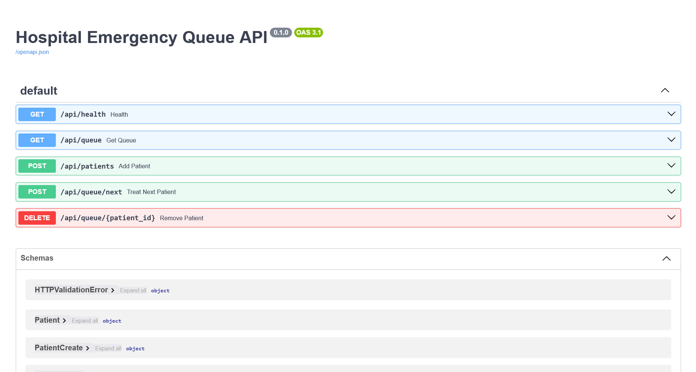
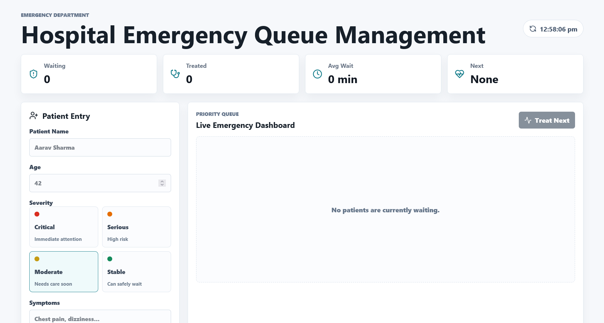

# Hospital Emergency Queue Management

Hospital Emergency Queue Management is a full-stack web application that simulates an emergency room triage queue. It uses a React + Vite frontend to collect patient data and display a real-time prioritized dashboard, and a FastAPI backend to manage queue ordering, wait-time estimates, and patient status.

Live deployments:
- Backend:

- Backend API: https://health-emergency-queue-management-backend.onrender.com/api

- frontend:

- Frontend app: https://health-emergency-queue-management.vercel.app

<!-- TODO: Add deployment documentation for staging and production builds. -->

## Project Overview

This project is designed to demonstrate how an emergency department queue can be managed using a priority queue:

- Frontend: React 19 application bundled with Vite 6
- Backend: FastAPI REST API with Python 3.12+ and in-memory queue management
- Priority logic: patients are ordered by severity, arrival time, and insertion sequence
- Real-time refresh: frontend polls backend every 2.5 seconds to update queue status

## Why this project matters

Emergency departments need to process patients in an order that balances urgency and fairness. This project implements a simplified triage queue that:

- treats `critical` patients first, then `serious`, `moderate`, and `stable`
- keeps patients with identical severity ordered by timestamp and arrival sequence
- estimates wait time based on average service minutes per severity level
- updates the dashboard instantly for staff to view queue changes

## Repository Structure

```text
crt-project/
  backend/
    main.py
    requirements.txt
    pyproject.toml
  frontend/
    package.json
    index.html
    src/
      App.jsx
      main.jsx
      styles.css
  README.md
```

## Frontend Details

The frontend is located in `frontend/` and includes:

- `package.json`: React 19, React DOM, Lucide icons, Vite
- `src/App.jsx`: main application UI, form handling, queue display, polling logic
- `src/main.jsx`: React root initialization
- `src/styles.css`: responsive UI styling, patient card design, priority color system

### Frontend dependencies

```json
"dependencies": {
  "react": "^19.0.0",
  "react-dom": "^19.0.0",
  "lucide-react": "^0.468.0"
},
"devDependencies": {
  "@vitejs/plugin-react": "^4.3.4",
  "vite": "^6.0.7"
}
```

### Frontend scripts

- `npm run dev` - start the local development server on `http://127.0.0.1:5173`
- `npm run build` - create a production build
- `npm run preview` - preview the production build locally

## Backend Details

The backend is located in `backend/` and includes:

- `main.py`: FastAPI application, queue logic, CORS setup, API endpoints
- `requirements.txt`: required Python packages for runtime
- `pyproject.toml`: project metadata and Python version requirement

### Backend dependencies

```text
fastapi==0.115.6
uvicorn[standard]==0.34.0
pydantic==2.10.5
```

### Backend features

- `GET /api/health`: simple health check
- `GET /api/queue`: retrieve current queue state, treated list, wait metrics
- `POST /api/patients`: add a new patient to the emergency queue
- `POST /api/queue/next`: mark the next patient as treated and remove them from waiting
- `DELETE /api/queue/{patient_id}`: remove a specific patient from the queue

### Queue behavior

- Patients are stored in-memory using `heapq` for priority ordering.
- Severity values are mapped to numeric ranks:
    - `critical` = 1
    - `serious` = 2
    - `moderate` = 3
    - `stable` = 4
- Patients with the same severity are ordered by creation timestamp and insertion sequence.
- Estimated wait time is computed using average service minutes per severity.

## Setup and Run Instructions

### 1. Run the backend

```bash
cd backend
python -m venv .venv
.venv\Scripts\activate
pip install -r requirements.txt
uvicorn main:app --reload --host 127.0.0.1 --port 8000
```

If you are using PowerShell on Windows, run:

```powershell
python -m venv .venv
.\.venv\Scripts\Activate.ps1
pip install -r requirements.txt
uvicorn main:app --reload --host 127.0.0.1 --port 8000
```

### 2. Run the frontend

```bash
cd frontend
npm install
npm run dev
```

Open the displayed local URL, usually `http://127.0.0.1:5173`, to access the application.

### 3. Application workflow

1. Open the frontend.
2. Enter patient details in the patient entry form.
3. Select severity and submit the form.
4. The dashboard updates automatically with the latest queue data.
5. Click `Treat Next` to remove the highest-priority patient.
6. Click the trash icon to remove a patient manually.

## How it works

- The frontend sends JSON requests to the backend API endpoint `http://127.0.0.1:8000/api`.
- A polling loop fetches queue state every 2.5 seconds so the dashboard stays in sync.
- The backend holds the queue in memory and does not persist data to disk.
- The queue state includes:
    - `queue`: ordered waiting patients
    - `treated`: last treated patients
    - `total_waiting`: number waiting
    - `total_treated`: number treated so far
    - `average_wait_minutes`: average estimated wait time

## Development Notes

- The application currently uses in-memory storage and is best suited for demo or prototype use.
- For production, replace the in-memory queue with a persistent database and add authentication.
- The React app uses controlled form state and validation for `name`, `age`, `severity`, and `symptoms`.
- The backend validates incoming patient payloads using Pydantic.

## Recommended improvements

<!-- TODO: Add logging and error tracking for API failures. -->
<!-- TODO: Implement database persistence for patient queue and treatment history. -->
<!-- TODO: Add user authentication and staff role management. -->
<!-- TODO: Add unit tests for backend queue logic and frontend form validation. -->
<!-- TODO: Add Docker support for unified frontend/backend deployment. -->

## Troubleshooting

- If the frontend cannot connect, verify the backend is running at `http://127.0.0.1:8000`.
- If CORS errors appear, confirm the backend CORS middleware allows the frontend origin.
- If the queue API returns errors, inspect the backend logs and validate request payloads.

## Contact

If you need help extending this project, please update the TODO section with the next features and review the code in `backend/main.py` and `frontend/src/App.jsx`.
